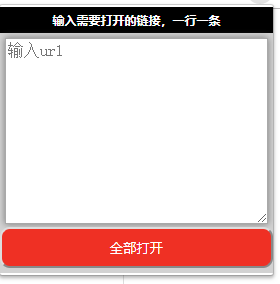

# 一次性打开多个标签页

一个简单的一次性打开多个链接至标签页的Chrome扩展

## 预览

## 功能介绍

输入多个链接，方便的一次性在新标签页中全部打开

## 如何使用

输入需要打开的链接，一行一条

## 联系作者

<a href="mailto:jiangkevin2@gmail.com">jiangkevin2@gmail.com</a>

## 如何获得
<a href="https://chrome.google.com/webstore/detail/%E4%B8%80%E6%AC%A1%E6%80%A7%E6%89%93%E5%BC%80%E5%A4%9A%E4%B8%AA%E6%A0%87%E7%AD%BE%E9%A1%B5/kfielgbmgniffolkphoafgelljpokcii">chrome store</a>

## 新功能

有了构思，会慢慢更新上来的，暂时这样了